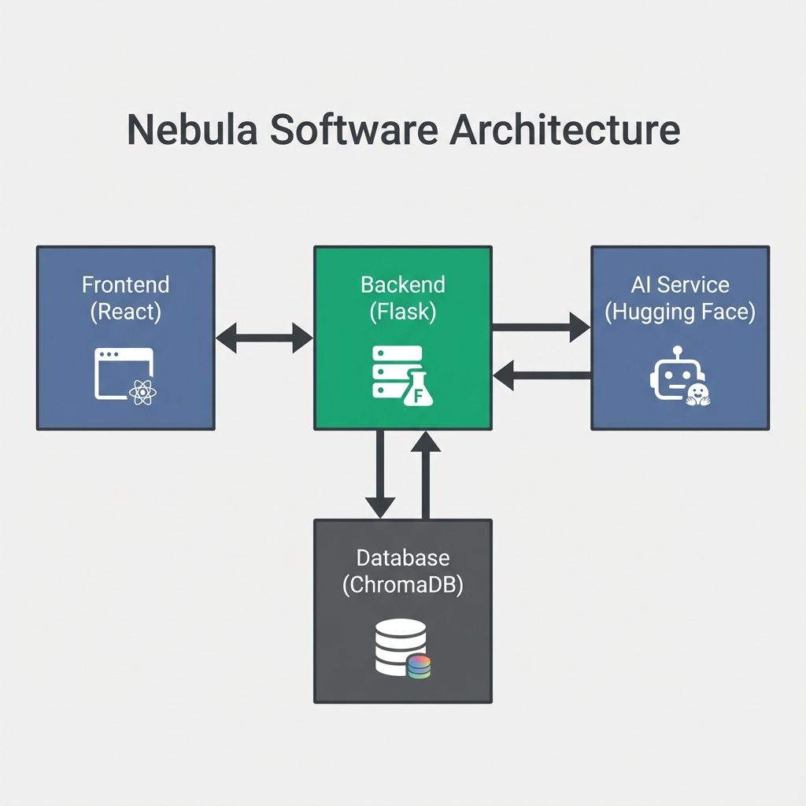

# 🌌 Nebula: AI-Powered Resume Intelligence

**Nebula** is a next-generation resume screening agent designed to revolutionize the recruitment process. Unlike traditional keyword scanners, Nebula utilizes **Semantic Search** and **LLM-based Reasoning** to deeply understand candidate profiles and match them against job descriptions with human-like nuance.


---

## 🏗️ System Architecture

Nebula operates on a modern, decoupled architecture ensuring scalability and performance.




Working Demo:
## Working Demo

[▶️ Watch the demo video](docs/Resume-Agent.mp4)

### Data Flow
1.  **Ingestion**: User uploads PDF -> Backend extracts text -> Embeddings generated -> Stored in ChromaDB.
2.  **Analysis**: User inputs Job Description -> Semantic Search in ChromaDB -> Top Matches + JD sent to Hugging Face LLM -> Structured Analysis returned.

---

## 🚀 Features & Limitations

### Features
-   **🧠 Semantic Intelligence**: Uses `SentenceTransformers` to understand the *meaning* of skills and experience, not just exact keyword matches.
-   **🤖 AI Reasoning Engine**: Powered by **Hugging Face (Mistral-7B)**, Nebula explains *why* a candidate is a good fit, highlighting pros, cons, and evidence.
-   **📂 Smart Ingestion**: 
    -   **Bulk Upload**: Drag and drop multiple PDFs.
    -   **Local Sync**: Automatically process resumes from your local `data/resumes` folder.
-   **⚡ Real-time Analysis**: Get instant feedback and ranking for candidates against any job description.
-   **🎨 Command Center UI**: A beautiful, dark-mode inspired interface built with **Tailwind CSS** for a premium user experience.

### Limitations
-   **PDF Only**: Currently only supports PDF resume parsing.
-   **Rate Limits**: Dependent on the free tier of Hugging Face Inference API, which may have rate limits or cold starts.
-   **Text Extraction**: Complex PDF layouts (columns, graphics) may occasionally result in imperfect text extraction.
-   **Context Window**: Extremely long resumes may be truncated before analysis to fit within the LLM's context window.

---

## 🛠️ Technology Stack

| Component | Technology | Description |
| :--- | :--- | :--- |
| **Frontend** | React, Vite | Fast, responsive UI with component-based architecture. |
| **Styling** | Tailwind CSS | Modern utility-first styling for a sleek look. |
| **Backend** | Flask (Python) | Lightweight and flexible REST API. |
| **Database** | ChromaDB | Open-source embedding database for semantic search. |
| **AI Model** | Hugging Face API | Uses `mistralai/Mistral-7B-Instruct-v0.2` for advanced reasoning. |
| **Embeddings** | all-MiniLM-L6-v2 | Efficient local embedding model for vector search. |

---

## ⚡ Getting Started

### Prerequisites
-   **Python 3.10+**
-   **Node.js 18+**
-   **Hugging Face API Key** (Free)

### 1. Backend Setup
```bash
cd backend
pip install -r requirements.txt
```

### 2. Frontend Setup
```bash
cd frontend
npm install
```

### 3. Configuration
Create a `.env` file in the root directory:
```env
HUGGINGFACE_API_KEY=your_api_key_here
```

### 4. Launch Nebula 🚀
You can start the entire application with the provided script:
```bash
./start_app.bat
```
*Alternatively, run backend and frontend in separate terminals.*

---

## 📖 How It Works

### Phase 1: Ingestion 📥
1.  **Upload**: Resumes are added via the UI or placed in the `data/resumes` folder.
2.  **Extraction**: The system extracts text from PDFs using `pypdf`.
3.  **Embedding**: Text is converted into vector embeddings using a local Sentence Transformer model.
4.  **Storage**: Vectors and metadata are stored in **ChromaDB**.

### Phase 2: Analysis 🔍
1.  **Search**: You provide a Job Description (JD).
2.  **Retrieval**: Nebula queries ChromaDB for the top 10 semantically similar resumes.
3.  **Reasoning**: The top matches and the JD are sent to the **Hugging Face Inference API**.
4.  **Evaluation**: The LLM acts as an expert recruiter, evaluating the candidate and returning a structured JSON response with:
    -   Match Score (0-100)
    -   Summary
    -   Strengths (Pros)
    -   Gaps (Cons)
    -   Evidence (Quotes)
5.  **Presentation**: Results are displayed in the dashboard, ranked by relevance.

---

## 🔮 Potential Improvements

-   **Multi-Format Support**: Add support for DOCX and TXT files.
-   **Advanced OCR**: Integrate OCR for image-based PDFs.
-   **Custom Models**: Allow users to select different LLMs (e.g., GPT-4, Claude) via configuration.
-   **Candidate Comparison**: Side-by-side comparison view for top candidates.
-   **Email Integration**: One-click email drafting to contact promising candidates.
-   **Feedback Loop**: Allow users to rate the AI's analysis to improve future results (RLHF).

---

## 🤝 Contributing
Contributions are welcome! Please fork the repository and submit a pull request.

---

*Built with ❤️ by the Nebula Team*
